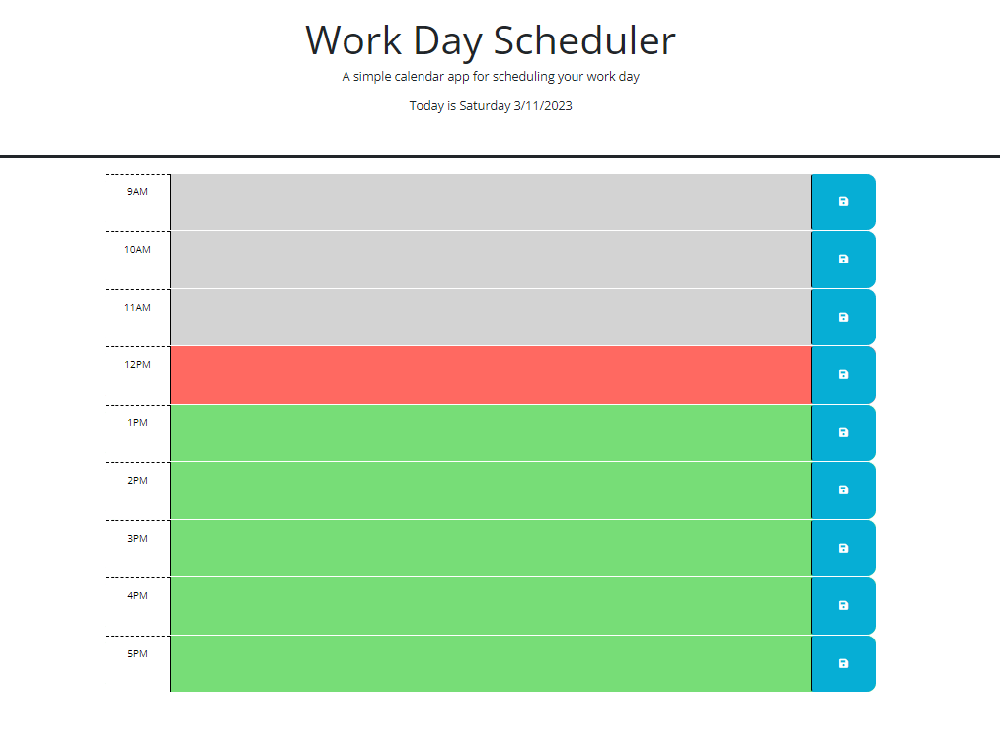

## Description

Welcome to my Workday Scheduler! I made this scheduler site with the goal of being able to plan out your whole work day from 9-5 while being able to save specific text inputs for every hour. I learned how to implement APIs into my websites and learned how to use Day.js to fetch current date and time information to paint the time containers different colors and also display the current day and date on the header of the screen. While also using local storage to save every entry and it loading up on refresh. All you have to do is type in your task and click save and done! it will be there on reaload. Just a simple display of API inclusion before the big project next week. Thanks for reading!

## Screenshot

## Usage
Just click on the link and take a look! https://rockoban420.github.io/workday_scheduler/